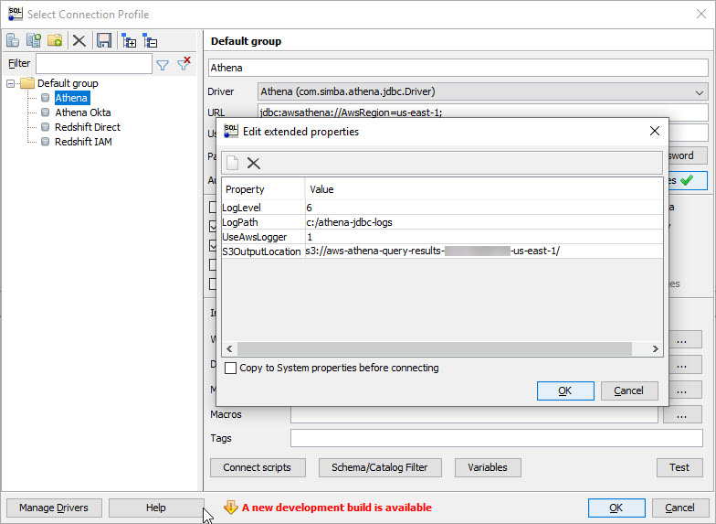
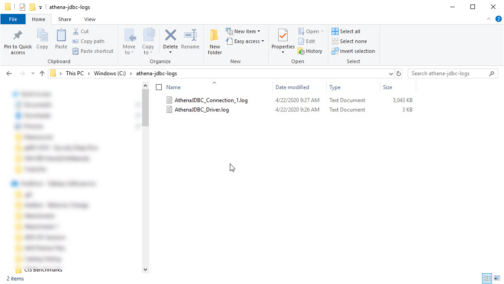
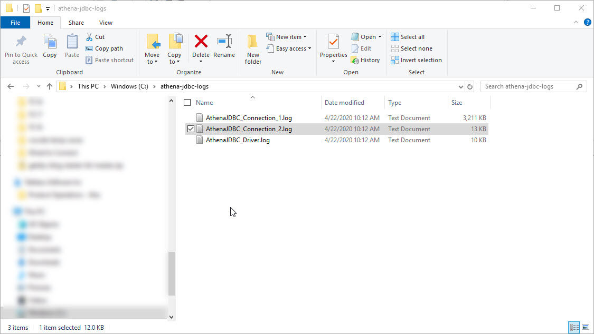

# Authenticating Tableau Users to Amazon Athena using Credential Providers

Tableau's Amazon Athena named connector supports IAM static access key credentials by default. This requires the user to supply an Access Key ID and a Secret Access Key. This has advantages when users publish content to Tableau Server because it is simple to store these credentials on the server or provide a simple prompt for Server users to enter their own credentials. This is similar to username and password support in other authentication models with the added advantage that users and applications can be provided with multiple credentials, or a single credential can be used as a service account by applications.

There are use cases where static credentials are not ideal and Amazon Athena supports other types of credentials. For example, customers may require Single Signon with Multi Factor Authentication for usersvia thier standard Identity and Access Management (IAM) platform. Other customers have requirements to leverage Session Tokens that only last for a limited lifetime. Other use cases include more complex cross account scenarios and requirements to leverage AWS profiles, containers or custom credential providers.

Tableau's named connector for Amazon Athena is based on the Simba JDBC Driver and this driver has strong support for many types of authentication using a Credential Provider Interface that is provided by the AWS Java SDK. The driver supports several built-in providers and also supports the ability to add custom providers. Tableau can take advantage of this support using a JDBC properties file to use these credentials providers. 

This document will how customers how to use a Tableau properties file to access the JDBC drivers built-in credential providers. I will also provide some code examples to create some simple custom providers using the AWS Java SDK to show some examples for use cases where the built-in support is not sufficient. For the built-in examples no coding is required but you may need the ability to configure a SAML IdP, have an EC2 instance, or have multiple accounts in AWS. This implies having access to a comprehensive testing environment, or the ability to coordintate with several roles across your Tableau, AWS and IAM provider platforms. We will start with the simplest scenarios that require the least amount of admin rights and tools. 

## Scenario Overview 

**1. The Baseline**: No customization required - Access ID and Secret Access Key. We will connect to Athena in SQL Workbench/J and Tableau using the default credentials. 

**2. Add Some Extended Properties**: This is more of a test to show how the various layers interact than a real use case. We will enable more detailed logging using the extended properties in SQL Workbench/J and show the equivalent properties in Tableau's *athena.properties* file.

**3. Properties File Credentials Provider**: In this scenario we get the Access ID and Secret Access Key from a file. This is not a scenario that I would expct to have much use in a production environment but it will get us started using AWS credentials components and how they related to the JDBC driver and hence the properties file in Tableau. This is important because much of the AWS and Simba documentation will use SQL Workbench/J to show how to customize the JDBC driver. It also starts to demonstrate that there is a relatinship between Tableau and the JDBC driver and the AWS IAM infrastructure, and AWS Java SDK.

**4. Instance Profile Credentials Provider**: This provider allows us to authenticate to Athena using the IAM Role that is tied to an EC2 Instance. This is very useful if Tableau Server is running on an EC2 Instance but it can also work if Tableau Desktop is running on the Instance. We will test both Desktop and Server. In this scenario the Athena Credentials are loaded from the Amazon EC2 Instance Metadata Service. This mneans that the user, or Tableau, does not need to know any secrets. 

**5. Secure Token Service**: AWS IAM has the concept of Temprorary Session Tokens. These tokens are provided by the AWS Secure Token Service (STS). Several of the Credentials Providers can leverage STS directly or indirectly. STS Tokens are dynamic and temporary so they have the advantage of not being needed to be stored in a location that could be compromised. 

## Applications, Tools and Roles Requirements for each Scenario

- **AWS Account with Athena and S3 Access** - If you are reading this you should already ove access to Athena and S3 but you may need console or CLI admin access to an Athena instance for the more advanced testing. Some of the examples here would not be a good idea in a production environment but I have attempted to keep things simple as possible so make sure you are comfortable with the security implications of some of these scenarios. for the basline and some of the tests you will need an Access ID and Secret Access Key so a test envirobment will be useful here. Later you will be able to apply the learnings to your production environment.

- **Amazon Athena JDBC driver** - See [Using Athena with the JDBC Driver](https://docs.aws.amazon.com/athena/latest/ug/connect-with-jdbc.html)

- **Tableau Desktop** -  We will use Tableau 2020.1

- **SQL Workbench/J** - Having access to a SQL Tool outside of Tableau that supports the Athena JDBC driver is stronghly recommneded. You will be able to learn from other sources of documentation as they often use SQL Workbench/J. SQL Workbench/J is free and can be downloaded from https://www.sql-workbench.eu/. I used the most current stable version as of April 2020 which was Build 125. Note you will require a Java Runtime or JDK.

- **Tableau Server**. We will use Tableau Server 2020.1. This could be a Windows or Linux version. We will need Tableau Server for all of these scenarios as thet all rely on an athena properties file that will be located on the Server so Tableau Online is not an option. If the server is on an EC2 Instance you can test the Instance Profile Credential Provider but many of other scenarios will work in an On Premise Server.

- **Okta** - The JDBC driver supports authentication using external IAM platforms like ADFS and Okta that provide SAML Authentication. This is different from the IdP support provided by Tableau for User Authentication to Tableau Server but you can access the same IdP to take advantage of the capabilities that the IdP provides like federated accounts. Note that user interactive MFA is not possible via the built in JDBC driver's interfaces but there may be some non-interactive options if you are able to extend some of the custom techniques discussed later. We use Okta in this article but the cncepts will be very similar for ADFS and any other IdP's that AWS supports.

- **AWS Java SDK and an Java IDE supportng Maven** - As of April 2020 the Athena JDBC driver (version 2.0.9) is built using the AWS Java SDK V1. Therefore we use the V1 SDK in spme custom provider examples. I will also dicusss some small issues that might force you to consider a custom provider for a feature that is built-in to the V2 SDK (this is related to leveraging profiles and credentials files) There are alos some issues with the signing of JARs that need to be addressed because the JDBC driver embeds packages from the AWS Java SDK.
- **A Second AWS Account** - A second account with Athena will allow us to test cross account role assuption scenarios. In these Scenarios Tableau Server may be installed in an EC2 Instance under onw account while Athena is installed in another account. When using static credentials this is not a problem but if you want to rely on some of the more advanced scenarios, like the Instance Profile Credentials Provider, you will need to be able to set up the right IAM Roles. 

- **Athena with a non-primary Workgroup** - This is not strictly a credentials issue but we can use the Tableau JDBC properties file to select non-primary Workgroups. Thica can be useful for customers levergaing Athena Workgroups to manage access Athena at scale.

## Detailed Scenarios

**1. The Baseline**

  * **SQL Workbench**: Follow the documentation in the [Simba Athena JDBC Driver Installation and Configuration Guide](https://s3.amazonaws.com/athena-downloads/drivers/JDBC/SimbaAthenaJDBC_2.0.9/docs/Simba+Athena+JDBC+Driver+Install+and+Configuration+Guide.pdf). Simply follow the instructions in the **Installing and Using the Simba Athena JDBC Driver section**.
  
  * **Tableau Desktop**: Follow the documentation in the Tableau Desktop Help Topic [Amazon Athena](https://help.tableau.com/current/pro/desktop/en-us/examples_amazonathena.htm). Use the same settings you used in the SQL Workbench/J test. 
  
    

**2. SQL Workbench/J Extended Properties and Tableau's Properties File** 

* **SQL Workbench/J**: You have already used an extended property in the baseline scenario to enter the S3 Bucket for the Athena result set so feel free to skip this step but if you want to see how we can map SQL Workbench/J extended properties to the Tableau Properties this exercise will also help you set up logging for troubleshooting purposes. You have already used extended properties in SQL Workbench/J for the Athena result set bucket in S3. We just need to add the logging properties. These properties are documented in the [Athena JDBC Driver Installation and Configuration Guide](https://s3.amazonaws.com/athena-downloads/drivers/JDBC/SimbaAthenaJDBC_2.0.9/docs/Simba+Athena+JDBC+Driver+Install+and+Configuration+Guide.pdf):



After setting your extended properties enter your ID and Key and test the connection. You should see some log files created in the log folder.



* **Tableau** The S3 result set bucket is not a special property for Tableau but everything else we will cover in this article will require a properties file on Desktop, or Server, so let's get started by enabling the same detailed logging as SQL Workbench/J.

On Tableau Desktop you will need to create an *athena.properties* file in your Tableau Repository Datasources folder. This is described in more detail in the [Customizing JDBC Connections KB Article](https://kb.tableau.com/articles/howto/Customizing-JDBC-Connections). To enable detailed logging the properties file will contain several key/value settings. Note that the key names and values are exactly the same as you entered in SQL Workbench. ([example](property-file-examples/scenario-2/athena.properties)):

```
loglevel=6
logpath=c:/athena-jdbc-logs
UseAwsLogger=1
```

Once you enable logging on the driver and perform a test connection and and query you will see some log files created in the logging folder.



If you are troubleshooting the useful information is usually in the connection file. and you will often see multiple connection files created during your testing. If you are testing SQL Workbench and Tableau at the same time you may want to put the log files in different folders.
